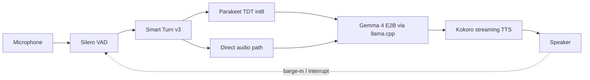

# LitheVoice

**Fast, interruptible voice AI on the hardware you have.**

LitheVoice is a local-first voice-agent runtime built around a short path from
speech to response. It combines voice activity detection, semantic turn
detection, optional speech recognition, a compact multimodal LLM, streaming
speech synthesis, interruption, editable personas, and a small local web UI.

No cloud inference or API key is required. Setup downloads pinned model files
from Hugging Face and a pinned llama.cpp build from GitHub; after that, the
conversation stays on the machine.

> Current release targets: **Windows x64** and **Linux x64**, both with Python
> 3.12. NVIDIA CUDA and CPU-only installs are supported by the setup scripts.
> AMD/Intel acceleration is not yet part of the tested installation path.

## Recommended setup

After `scripts/setup.sh`, these are the two configurations worth using.

**At the desk** — everything on the GPU, voice barge-in, dashboard on
`http://127.0.0.1:7860`:

```bash
./run.sh --barge-in
```

Measured on an RTX 4090: **516–597 ms voice-to-voice**, first audio ~145 ms,
the reply ducks ~65 ms after you start speaking and resumes if you were only
saying "mm-hmm".

**From a phone on your own network** — the browser becomes the microphone and
speaker:

```bash
./run.sh --phone --barge-in
```

Startup prints an `https://<your-lan-ip>:7860/phone?t=...` URL. Open it on the
phone, accept the certificate warning, tap **Start talking**. Headphones or
AirPods give the cleanest interruption. Measured over Wi-Fi: **494–754 ms
voice-to-voice**, with ducking and barge-in intact. Details and caveats in
[docs/PHONE.md](docs/PHONE.md).

Useful additions to either:

| Flag | When |
|---|---|
| `--aec` | open speakers instead of headphones |
| `--barge-key` | speakers, and you want the guaranteed-safe hold-to-interrupt mode |
| `--lite` | small install, no PyTorch, CPU synthesis ([docs/LITE.md](docs/LITE.md)) |
| `--no-llm` | canned replies, for checking the audio path |
| `--speaker-lock` | experimental; calibrate the threshold first |

## Pipeline



The standard path uses Parakeet for a reliable transcript. `--direct-audio`
sends the utterance itself to Gemma's audio encoder and keeps Parakeet only as
an after-the-fact reference transcript.

## Highlights

- **Fast turn handling:** Silero runs frame by frame; Parakeet starts
  speculatively during the silence window; Smart Turn can confirm completion
  before the fallback timeout.
- **Streaming end to end:** Gemma tokens are grouped into sentences and handed
  to Kokoro as soon as each sentence is ready.
- **Interruptible speech:** use voice barge-in with a headset, or the
  speaker-safe keyboard/web interrupt mode with open speakers.
- **Two input paths:** dedicated Parakeet STT or direct multimodal audio.
- **Adaptive hardware:** setup selects CUDA when it validates successfully and
  otherwise installs CPU builds. llama.cpp uses automatic layer fitting.
- **Useful mixed mode:** on NVIDIA, the tested default is Gemma and Kokoro on
  CUDA while Parakeet stays on CPU int8, where it measured faster.
- **Local dashboard:** conversation, state, latency, persona, voice, speaking
  speed, and interruption controls at `http://127.0.0.1:7860`.
- **Editable personas:** plain text system prompts plus few-shot examples, all
  prewarmed into the prompt prefix.

## Requirements

- 64-bit Windows 10/11, or 64-bit Linux with glibc 2.35+ (Ubuntu 22.04+)
- Python 3.12 x64
- A microphone and audio output device
- At least 12 GB free for a normal installation and temporary downloads
- Optional: an NVIDIA GPU with a current driver
- Linux only: PortAudio and libsndfile (`sudo apt install libportaudio2
  libsndfile1`), plus X11 if you want the `--barge-key` hotkey

The pinned default downloads are roughly 4.4 GB for Gemma and its audio
projector, 660 MB for Parakeet int8, 330 MB for Kokoro and voices, plus
llama.cpp and Python wheels.

## Install

Clone the repository and run the setup script for your platform:

```powershell
# Windows
git clone https://github.com/BantamFactory/lithevoice.git
cd lithevoice
powershell -ExecutionPolicy Bypass -File .\scripts\setup.ps1
```

```bash
# Linux
git clone https://github.com/BantamFactory/lithevoice.git
cd lithevoice
./scripts/setup.sh
```

Setup is resumable and idempotent. It creates `.venv`, installs matching
PyTorch/torchaudio and ONNX Runtime builds, downloads exact model revisions,
verifies the large artifacts by SHA256, installs llama.cpp, and runs the
installation doctor.

CPU-only installation:

```powershell
powershell -ExecutionPolicy Bypass -File .\scripts\setup.ps1 -CpuOnly   # Windows
```

```bash
./scripts/setup.sh --cpu-only                                          # Linux
```

Optional fp32 Parakeet for experimenting with GPU STT (about 2.5 GB extra):
`-IncludeGpuStt` on Windows, `--include-gpu-stt` on Linux.

The CPU int8 Parakeet path remains the default because it was faster on the
reference system.

### llama.cpp on Linux

Upstream publishes no prebuilt **Linux CUDA** binary, so `setup.sh` resolves
the llama.cpp backend to CPU even when an NVIDIA GPU is present. Kokoro and
Parakeet still use the GPU through PyTorch and ONNX Runtime whenever CUDA
validates. For GPU-accelerated Gemma on Linux, either:

```bash
./scripts/setup.sh --llama-backend vulkan     # prebuilt, works on NVIDIA
```

or build llama.cpp with `-DGGML_CUDA=ON` and point `LITHEVOICE_LLAMA_DIR` at
that build.

## Run

Recommended open-speaker launch:

```powershell
.\run.ps1 --barge-key    # Windows
```

```bash
./run.sh --barge-key     # Linux
```

The examples below use `run.ps1`; substitute `./run.sh` on Linux (and forward
slashes in paths).

The launcher sets the project-local model cache, starts the local dashboard,
loads and warms the voice models, then listens on the default microphone.

Common modes:

```powershell
# Standard Parakeet -> Gemma -> Kokoro path
.\run.ps1

# Send captured audio directly to Gemma's multimodal encoder
.\run.ps1 --direct-audio

# Voice-triggered barge-in; use a headset to prevent speaker echo
.\run.ps1 --barge-in

# Canned response path without llama.cpp, useful for audio validation
.\run.ps1 --no-llm

# Feed one WAV and write reply_0.wav without using audio hardware
.\run.ps1 --simulate .\tests\roundtrip_1.wav --no-play --no-web --no-menu
```

## Hardware Selection

| Component | NVIDIA default | CPU-only default | Override |
|---|---|---|---|
| Gemma / llama.cpp | automatic GPU layer fitting | CPU | `--llm-device auto\|cpu\|gpu` |
| Kokoro TTS | CUDA | CPU | `--tts-device auto\|cpu\|cuda` |
| Parakeet STT | CPU int8 | CPU int8 | `--stt-device auto\|cpu\|cuda` |
| Smart Turn | CPU ONNX | CPU ONNX | none |
| Silero VAD | CPU | CPU | none |

Explicit device flags fail clearly when the requested runtime is unavailable.
Only `auto` falls back.

## Interruption Modes

### Speaker-safe key interruption

`--barge-key` ignores the microphone while LitheVoice speaks. Hold the backtick
or tilde key, or click **interrupt** in the dashboard, to stop playback and hand
the turn back immediately. This is the reliable mode for laptop speakers.

The hotkey is read globally, regardless of window focus: `GetAsyncKeyState` on
Windows and `XQueryKeymap` on Linux/X11 (no root and no `input` group needed).
Under a pure Wayland session there is no global key state to poll, so the key
is inert and the dashboard's **interrupt** button is the way to take the turn
back.

### Voice barge-in

`--barge-in` keeps listening while the reply plays and yields when you start
talking. The response is staged rather than all-or-nothing:

| After | What happens | Reversible |
|---|---|---|
| ~96 ms | the reply **ducks** to -16 dB | yes |
| ~352 ms | the reply **holds** — silent, keeping its place | yes |
| ~1400 ms | the turn is **abandoned** | no |
| turn end | a backchannel **resumes** the reply where it stopped | — |

Only the last step throws anything away, and what you perceive as the
assistant yielding is the first one. That gap is the whole design: it is quiet
almost immediately, which buys nearly a second to work out whether you meant
to take the floor. Say "mm-hmm" and it dips and carries on; say "wait,
actually…" and it stops for good.

Deciding whether a frame is *you* uses three signals (`SpeechAdmit`): the VAD
probability, energy above an adaptive room-noise floor, and energy above the
echo predicted from the playback reference. The same verdict also gates
turn-taking, so a fan or your own echo cannot open a turn — measurably the
larger problem, since answering a noise cancels whatever the assistant was
already saying. At the turn boundary the transcript settles the rest: short
acknowledgements keep the floor with the assistant, and sound with no words in
it is discarded instead of answered.

Tuning, if your room needs it:

```bash
./run.sh --barge-in --barge-duck-ms 128 --barge-cancel-ms 1200 --barge-snr-db 9
```

**Other voices in the room.** A television is real speech — it scores p=1.00
on the VAD for 77% of its frames and sits *further* above the noise floor than
you do, so no amount of level or spectrum tuning rejects it. Identity is the
only thing that separates it. Measured ceiling, from
`tests/bargein_sim.py --oracle-speaker`: perfect identity takes the television
scenario from 13 destroyed replies to 1.

### Speaker lock (experimental, off by default)

`--speaker-lock` enrols your voice and lets only that voice take a turn.
Others may briefly duck the reply — an embedding needs about a second of audio
and the duck fires in a tenth of one — but they are discarded at the turn
boundary with `[other voice] ignored`.

```bash
./run.sh --barge-in --speaker-lock --enroll   # learn your voice, then lock
```

Enrolment is explicit: say a sentence twice, at startup with `--enroll` or via
**Learn my voice** in the dashboard. The profile is saved to
`models/voice_profile.npz` and reused on later runs.

It ships **off** because the default threshold (`0.40`) was measured against
synthetic speech and rejected a real user at `0.32`. The separation is real —
that user scored 0.32 where a second person scored 0.15 — but the operating
point needs calibrating against your own microphone with `--speaker-threshold`
before this is trustworthy. See
[docs/BARGE_IN.md §7](docs/BARGE_IN.md) for the measurements.

It costs no GPU: 26.5 MB of ONNX on the CPU, run once per turn (~12–25 ms),
with the session warmed at startup.

Use a headset if you want none of this to matter; `--aec` also helps with open
speakers.

Full design, measurements, tuning and limitations:
[docs/BARGE_IN.md](docs/BARGE_IN.md). `LITHEVOICE_BARGE_DEBUG=1` logs which
test rejected each frame.

`--aec` enables the experimental software echo canceller. It performs well in
synthetic tests but did not cancel the reference laptop's microphone-array DSP
reliably enough to replace a headset or `--barge-key`.

## Personas

Personas are files in `personas\`. The first block is the system prompt. Each
later `---` block is a demonstration turn where `>` introduces the user's line:

```text
You are a concise, practical voice assistant. Reply in one or two sentences.
---
> Give me the short version.
Sure. Here is the part that matters most.
```

The examples are rendered as prior turns and live in the prewarmed KV-cache
prefix. Two to five short, distinctive examples work better than a long
character description.

Select a persona at startup, pass `--persona NAME`, or switch from the web UI.
Changing persona clears conversation memory and prewarms the new prefix.

## Web UI

Live mode opens `http://127.0.0.1:7860`. The server binds only to localhost.
Audio remains in the Python process; the page receives state and conversation
events over Server-Sent Events and sends controls back with local HTTP POSTs.

The UI includes:

- live pipeline state and audio visualization
- user and assistant turns as they become available
- per-turn STT, LLM, first-audio, and true voice-to-voice timing
- persona and voice selection
- speaking-speed control
- interrupt and shutdown controls

Use `--no-web` to disable it or `--web-port N` to choose another starting port.

## Latency

On the reference RTX 4050 Laptop GPU plus Ryzen CPU, the original tuned stack
measured roughly **450-700 ms from turn dispatch to first reply audio**. A live
voice-to-voice number also includes the normal ~224 ms Smart Turn observation
window and its short inference step.

LitheVoice logs both parts instead of labeling post-confirmation processing as
the entire voice-to-voice interval:

```text
  STT wait         : 0 ms   (speculative - ran during silence window)
  LLM first-token  : 55 ms
  first-audio      : 410 ms
  turn decision    : 246 ms
  VOICE-TO-VOICE   : 656 ms   (end-of-speech -> first sound)
```

Numbers vary significantly with the microphone, prompt, sentence length,
storage, CPU, GPU, and whether models are warm.

## Models

All revisions, filenames, sizes, and critical hashes are recorded in
[`scripts/models.json`](scripts/models.json). Model weights and binaries are
downloaded locally and excluded from Git.

| Role | Upstream | Default artifact |
|---|---|---|
| LLM + audio encoder | [stock Gemma 4 E2B (ggml-org GGUF)](https://huggingface.co/ggml-org/gemma-4-E2B-it-GGUF) | Q4_K_M + BF16 mmproj |
| Speech recognition | [Parakeet TDT 0.6B v2 ONNX](https://huggingface.co/istupakov/parakeet-tdt-0.6b-v2-onnx) | int8 encoder/decoder |
| Speech synthesis | [Kokoro-82M](https://huggingface.co/hexgrad/Kokoro-82M) | v1.0 + curated voices |
| Voice activity | [Silero VAD](https://github.com/snakers4/silero-vad) | package-provided model |
| Turn completion | [Smart Turn v3](https://huggingface.co/pipecat-ai/smart-turn-v3) | v3.2 CPU ONNX |
| LLM runtime | [llama.cpp](https://github.com/ggml-org/llama.cpp) | Windows build `b9867` |

Downloaded artifacts remain governed by their upstream licenses and terms.
Review the model cards and [Gemma Terms of Use](https://ai.google.dev/gemma/terms)
before redistributing weights or using them beyond this private project.

## Configuration

Every path is relative to the repository by default. These environment
variables override local locations:

| Variable | Purpose |
|---|---|
| `LITHEVOICE_MODELS_DIR` | model and Hugging Face cache root |
| `LITHEVOICE_LLAMA_DIR` | llama.cpp runtime directory |
| `LITHEVOICE_MODEL` | exact LLM GGUF path |
| `LITHEVOICE_MMPROJ` | exact multimodal projector path |
| `LITHEVOICE_PERSONA_DIR` | persona directory |

Legacy `DADAI_*` names are accepted as compatibility aliases.

## Diagnostics And Tests

On Linux, substitute `./.venv/bin/python` for `.\.venv\Scripts\python.exe`.

```powershell
# Fast dependency, device, model-size, llama.cpp, and audio-device checks
.\.venv\Scripts\python.exe .\scripts\doctor.py

# Also hash every multi-GB model
.\.venv\Scripts\python.exe .\scripts\doctor.py --full

# Compile all Python sources
.\.venv\Scripts\python.exe -m compileall realtime.py webui.py whisper_features.py scripts tests

# Audio-stack smoke test without the LLM
.\run.ps1 --simulate .\tests\roundtrip_1.wav --no-play --no-llm --no-web --no-menu
```

### Barge-in simulation

`tests/bargein_sim.py` runs the real `run_live()` loop against a virtual
full-duplex device: the assistant's Kokoro audio is played into a modelled
room and returns to the microphone as echo, mixed with a background bed and
with user speech scheduled relative to the reply. It touches no audio
hardware, so it is silent and repeatable, and it scores what actually matters
— how a reply *died*, by whichever path.

```bash
./.venv/bin/python tests/bargein_assets.py     # generate the voices and beds
./.venv/bin/python tests/bargein_sim.py --list
./.venv/bin/python tests/bargein_sim.py                    # whole suite
./.venv/bin/python tests/bargein_sim.py --legacy           # the old gate
./.venv/bin/python tests/bargein_sim.py --oracle-speaker   # identity ceiling
./.venv/bin/python tests/bargein_probe.py      # what the gate actually sees
./.venv/bin/python tests/bench_tts.py          # CPU synthesis backends
```

`bench_tts.py` compares Kokoro on PyTorch against ONNX Runtime at a matched
thread budget. ONNX was measured and **not** adopted (a wash at 4-8 threads,
slower at 12, and ~3x slower quantised); see
[CHANGELOG.md](CHANGELOG.md#measured-and-rejected). It remains useful for
answering "would a different runtime help?" with numbers.

Scenarios cover a headset, open speakers at two levels with and without the
AEC, backchannels, a keyboard, a desk fan, a television, and double-talk over
loud speakers. Timings vary a little run to run because the whole thing is
real-time and CPU-bound.

The files in `tests\` are hardware-oriented validation scripts rather than a
fully isolated unit-test suite. Some load real models and may take time.

## Project Layout

| Path | Purpose |
|---|---|
| `realtime.py` | VAD, turn handling, STT, LLM client, TTS, interruption, AEC, and menus |
| `webui.py` / `webui.html` | localhost event server and dashboard |
| `personas\` | editable persona definitions |
| `scripts\setup.ps1` | hardware-aware Windows installation |
| `scripts/setup.sh` | hardware-aware Linux installation |
| `run.ps1` / `run.sh` | launchers that set the project-local model cache |
| `docs/BARGE_IN.md` | turn-taking and barge-in design, measurements, tuning |
| `tests/bargein_sim.py` | silent virtual-acoustic simulation of the real loop |
| `tests/bargein_probe.py` | measures what the gate sees, for picking thresholds |
| `tests/bargein_assets.py` | generates the simulated voices and noise beds |
| `tests/bench_tts.py` | compares CPU synthesis backends (PyTorch vs ONNX) |
| `lite_backends.py` | torch-free ONNX synthesis and VAD (`--lite`) |
| `phone_transport.py` / `phone.html` | browser as microphone and speaker (`--phone`) |
| `tests/policies.py` | alternative barge-in policies, for A/B measurement |
| `requirements-lite.txt` | dependency set for the torch-free build |
| `scripts\download_models.py` | resumable pinned downloads and verification |
| `scripts\doctor.py` | installation diagnostics |
| `scripts\models.json` | artifact manifest and checksums |
| `whisper_features.py` | vendored NumPy features used by Smart Turn |
| `tests\` | turn, interruption, AEC, and end-to-end hardware checks |
| `models\` | downloaded weights and `voice_profile.npz`; ignored by Git |
| `llama.cpp\` | downloaded runtime; ignored by Git |

### Lite profile (no PyTorch)

`--lite` swaps synthesis and voice activity detection to ONNX and drops the
PyTorch dependency entirely. Measured: a **390 MB** environment instead of
**6.0 GB**, at the same synthesis throughput (RTF 0.16 on CPU). CPU only, and
speaker lock is unavailable. Install from `requirements-lite.txt`; details and
caveats in [docs/LITE.md](docs/LITE.md).

```bash
./run.sh --lite                 # ONNX synthesis + ONNX VAD
./run.sh --tts-backend onnx     # just the synthesiser
```

Implementation details are in [docs/ARCHITECTURE.md](docs/ARCHITECTURE.md);
turn-taking and barge-in have their own deep dive in
[docs/BARGE_IN.md](docs/BARGE_IN.md). What would have to change to serve more
than one conversation is recorded in [docs/SCALING.md](docs/SCALING.md), and
the torch-free build in [docs/LITE.md](docs/LITE.md), and phone/browser audio
in [docs/PHONE.md](docs/PHONE.md).
Recent work and known issues are in [CHANGELOG.md](CHANGELOG.md).

## Troubleshooting

**Setup cannot find Python 3.12**

Install Python 3.12 x64 from python.org, ensure the `py` launcher is enabled,
and rerun setup.

**CUDA was detected but setup falls back to CPU**

Update the NVIDIA driver, rerun with `-ForceDownloads`, and inspect
`scripts\doctor.py` output. Setup only keeps CUDA when
`torch.cuda.is_available()` succeeds.

**`WinError 127` while importing torchaudio**

Torch and torchaudio do not match. Rerun `scripts\setup.ps1`; do not install a
different torchaudio wheel into `.venv` manually.

**The assistant interrupts itself**

Use `--barge-key` with speakers or `--barge-in` with a headset.

**The model server will not start**

Read `llama.cpp\server.log`, then run the doctor. LitheVoice only terminates a
llama-server PID that it previously recorded; it will not kill unrelated
llama-server processes.

**A download stopped halfway**

Run setup again. Hugging Face and GitHub archive downloads resume or reuse
verified files.

**Closing the browser did not stop the runtime**

The browser is only a local controller. Use its stop button or press `Ctrl+C`
in the terminal.

## Current Limitations

- Windows x64 and Linux x64 are the automated installation targets. The
  published latency figures come from the Windows reference system.
- Linux has no prebuilt CUDA llama.cpp; see "llama.cpp on Linux" above.
- `--barge-key` needs X11; it is inert under pure Wayland.
- The default STT and curated Kokoro voices are English-focused.
- Open-speaker voice barge-in depends heavily on acoustic echo behavior.
- Direct audio is experimental and may be less reliable than dedicated ASR.
- This private repository does not currently grant a public code license.
